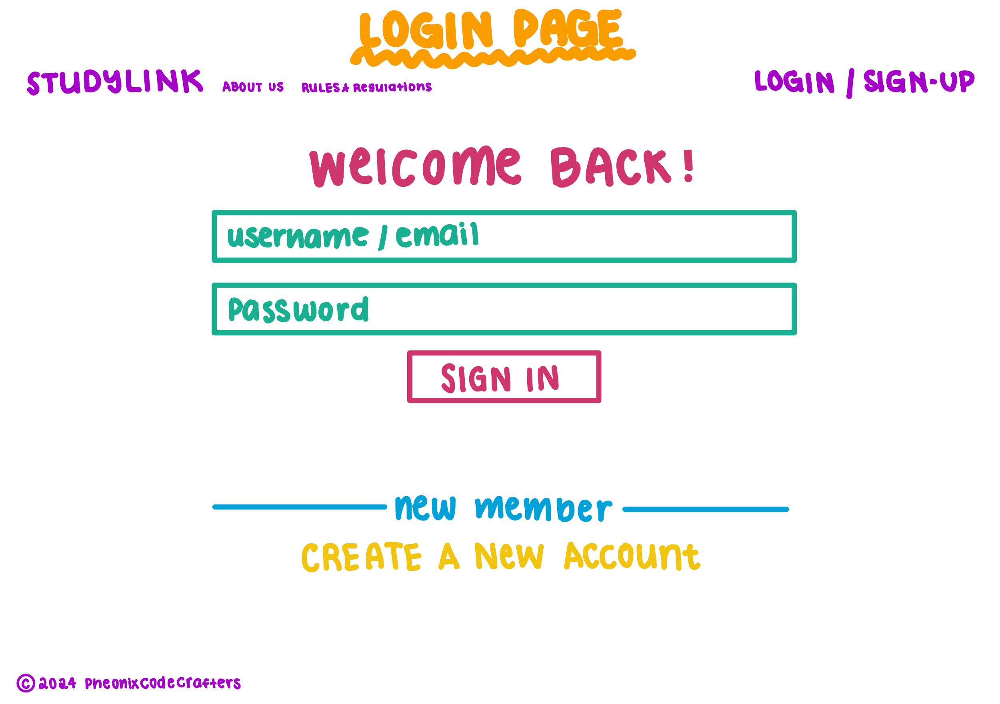
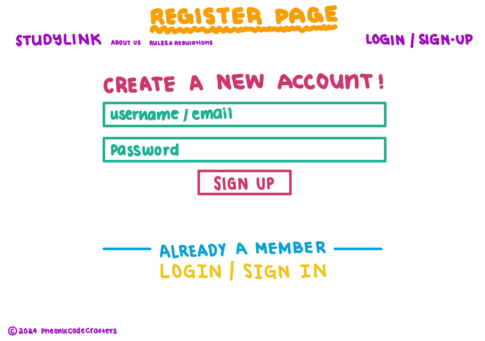
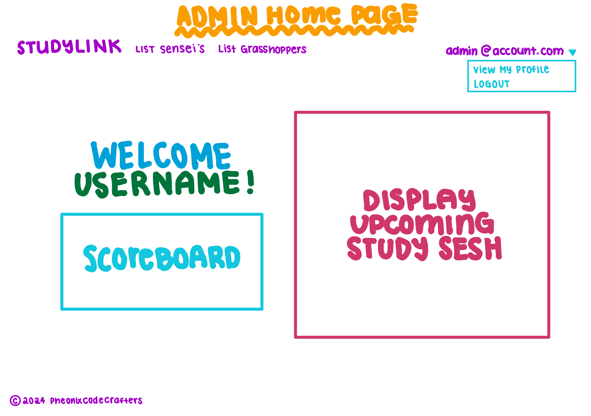
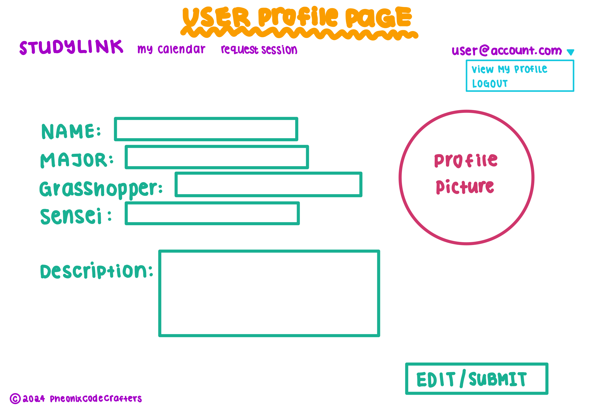
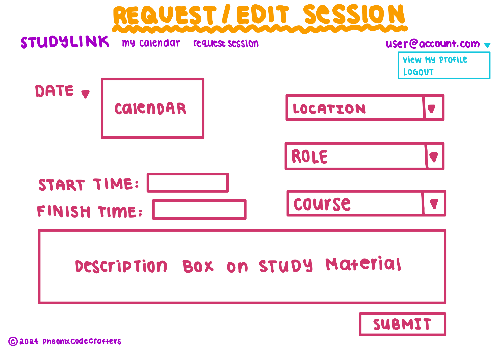

# StudyLink

Nowadays, it's pretty rare to see students interacting face-to-face with their peers. It's tough to ask for help when everyone else seems to be doing just fine. But have no fear, because StudyLink is here to help!

Our web platform connects students with others who are studying the same things. You can collaborate on assignments, projects, and exam prep with your buddies. With features like "create" and "attend," scheduling and joining study sessions has never been easier. Plus, you can keep track of past, present, and future study sessions, and see who else is involved.

StudyLink is simple and easy to use. It's a safe and supportive place where you can work together with your classmates and make studying more enjoyable.

  

StudyLink is an application that allows users to:

  * Register an account
  * Join /create a group
  * Set up your profile
  * Add your classes
  * Create Study Sessions
  * Leaderboard
  * View Calendar Study Sessions


## Installation
First, install Meteor.

Second, download a copy of Study Buddy. Note that Study Buddy is a private repo and so you will need to request permission from the author to gain access to the repo.

Third, cd into the app directory install the required libraries with:

```
$ meteor npm install

```

Once the libraries are installed, you can run the application by invoking:

```
$ meteor npm run start

```

The first time you run the app, it will create some default users and data. Here is the output:

```
meteor npm run start

> meteor-application-template-react@ start /Users/philipjohnson/github/philipmjohnson/digits/app
> meteor --no-release-check --settings ../config/settings.development.json

[[[[[ ~/github/philipmjohnson/digits/app ]]]]]

=> Started proxy.                             
=> Started MongoDB.                           
I20180305-18:06:02.764(-10)? Creating the default user(s)
I20180305-18:06:02.803(-10)?   Creating user admin@foo.com.
I20180305-18:06:02.803(-10)?   Creating user john@foo.com.
I20180305-18:06:02.804(-10)? Creating default contacts.
I20180305-18:06:02.804(-10)?   Adding: Johnson (john@foo.com)
I20180305-18:06:02.804(-10)?   Adding: Casanova (john@foo.com)
I20180305-18:06:02.804(-10)?   Adding: Binsted (admin@foo.com)
=> Started your app.

=> App running at: http://localhost:3000/
W20180305-18:06:02.805(-10)? (STDERR) Note: you are using a pure-JavaScript implementation of bcrypt.
W20180305-18:06:02.805(-10)? (STDERR) While this implementation will work correctly, it is known to be
W20180305-18:06:02.806(-10)? (STDERR) approximately three times slower than the native implementation.
W20180305-18:06:02.806(-10)? (STDERR) In order to use the native implementation instead, run
W20180305-18:06:02.806(-10)? (STDERR) 
W20180305-18:06:02.806(-10)? (STDERR)   meteor npm install --save bcrypt
W20180305-18:06:02.806(-10)? (STDERR) 
W20180305-18:06:02.806(-10)? (STDERR) in the root directory of your application.
```

Note regarding bcrypt warning. You will also get the following message when you run this application:

```
Note: you are using a pure-JavaScript implementation of bcrypt.
While this implementation will work correctly, it is known to be
approximately three times slower than the native implementation.
In order to use the native implementation instead, run

  meteor npm install --save bcrypt

in the root directory of your application.
```

On some operating systems (particularly Windows), installing bcrypt is much more difficult than implied by the above message. Bcrypt is only used in Meteor for password checking, so the performance implications are negligible until your site has very high traffic. You can safely ignore this warning without any problems during initial stages of development.

If all goes well, the template application will appear at http://localhost:3000. You can login using the credentials in settings.development.json, or else register a new account.

Lastly, you can run ESLint over the code in the imports/ directory with:

```
meteor npm run lint
```
## User Interface Walkthrough

### Landing Page
User goes to landing page, logs in, requests study sesh:

    

### Login Page
User or Admin can Login with their existing account by clicking on “Login”, then entering their username/email and password:

    

### Register
If you do not yet have an account on the system, you can register by clicking on “Login”, then “Sign Up”:

    

### User home page
User goes to landing page, logs in, gets home page, edits site:


### Admin home page
Admin goes to landing page, logs in, gets home page, edits site:

   


### User profile page
After successfully logging in, the system takes you to your home page. It is just like the landing page, but the NavBar contains links to list contact and add new contacts:

    

### Calendar page
Clicking on the List Contacts link brings up a page that lists all of the contacts associated with the logged in user:

   


### Study Sesh page
From the List Contacts page, the user can click the “Edit” link associated with any Contact to bring up a page that allows that Contact information to be edited:

  

### Create Study Sesh Page


## Game mechanic page(s) (for example, a leaderboard?)


## External Links
* [Team Contract](https://docs.google.com/document/d/19e88MkfUT4tdWFnGkv8DtAIhVrYXPxZpmWGlqF-Ryiw/edit?usp=sharing)
