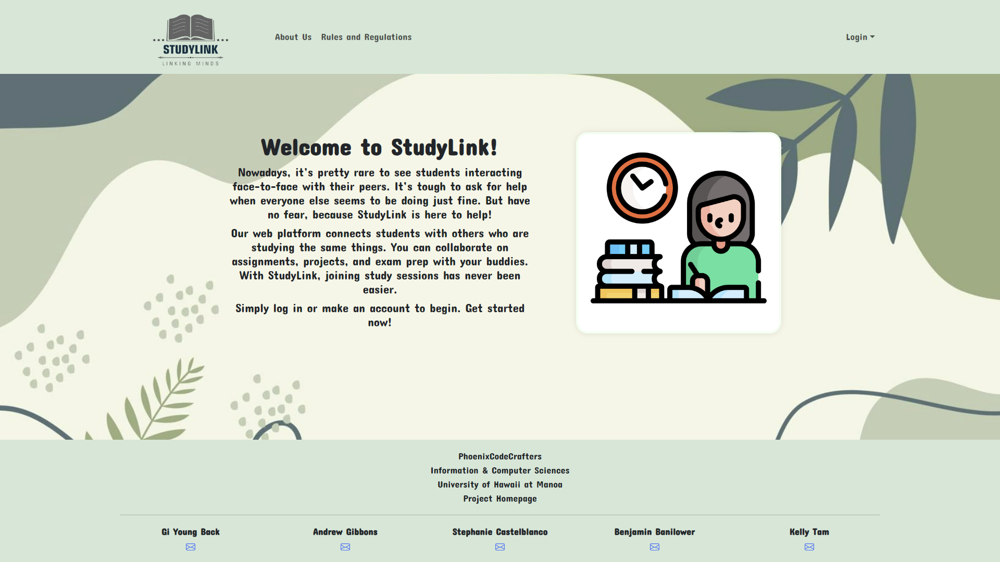
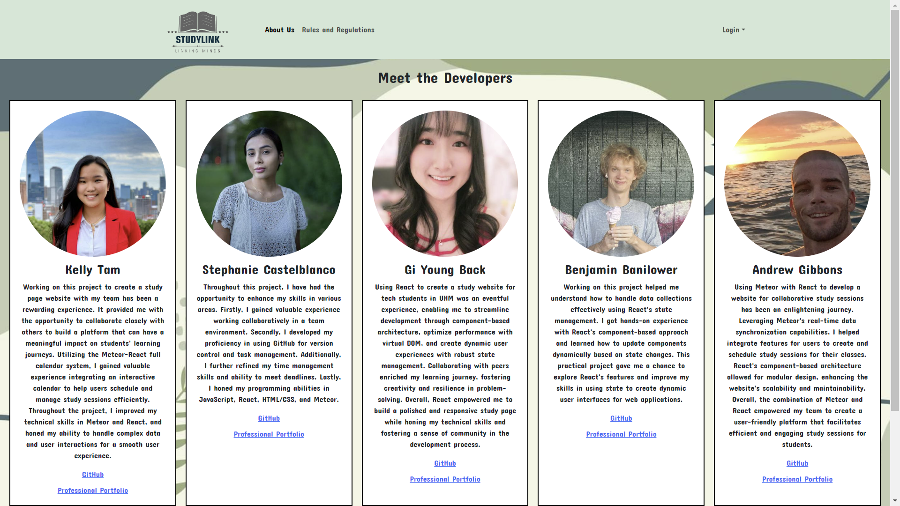
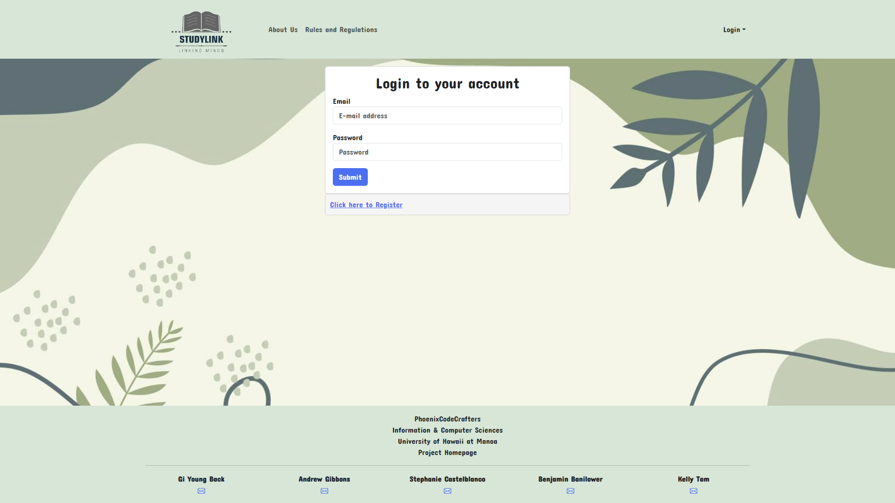

# StudyLink

## Overview 
Nowadays, it's pretty rare to see students interacting face-to-face with their peers. It's tough to ask for help when everyone else seems to be doing just fine. But have no fear, because StudyLink is here to help!

Our web platform connects students with others who are studying the same things. You can collaborate on assignments, projects, and exam prep with your buddies. With features like "create" and "attend," scheduling and joining study sessions has never been easier. Plus, you can keep track of past, present, and future study sessions, and see who else is involved.

StudyLink is simple and easy to use. It's a safe and supportive place where you can work together with your classmates and make studying more enjoyable.

StudyLink is an application that allows users to:
  * Register an account
  * Join /create a group
  * Set up your profile
  * Add your classes
  * Create Study Sessions
  * Leaderboard
  * View Calendar Study Sessions

## Developer Guide 

## Installation
The instructions below will guide you through the process of downloading, installing, running, and modifying the application on your local device.

1. In order to begin using the application you will need to install<a href="https://www.meteor.com/install"> Meteor.</a>

2. Next, you will need to clone our repository<a href="https://github.com/phoenix-codecrafters/StudyLink"> StudyLink </a>.

3. Using any IDE of your choice (our team used IntelliJ IDEA), in the command prompt you will need to cd into the app directory (within the code-directory file) and install the Meteor library as follows:
```
meteor npm install
```
 
4. Once the libraries are installed, you can run the application by invoking:
```
meteor npm run start
```

5. The first time you run the app, it will create some default users and data. Here is the output:

```
 meteor npm run start 

> meteor-application-template-react@ start /Users/carletonmoore/GitHub/ICS314/meteor-application-template-react/app
> meteor --no-release-check --exclude-archs web.browser.legacy,web.cordova --settings ../config/settings.development.json

[[[[[ ~/GitHub/StudyLink/app ]]]]]

=> Started proxy.                             
=> Started HMR server.                        
=> Started MongoDB.                           
I20220529-12:09:18.384(-10)? Creating the default user(s)
I20220529-12:09:18.389(-10)?   Creating user admin@foo.com.
I20220529-12:09:18.453(-10)?   Creating user john@foo.com.
=> Started your app.

=> App running at: http://localhost:3000/
```

If all goes well, the template application will appear at [http://localhost:3000](http://localhost:3000).

 You can login using the credentials in settings.development.json, or else register a new account.

6. Lastly, you can run ESLint over the code in the imports/ directory with:

```
meteor npm run lint
```

## User Interface Walkthrough

### Landing Page
User goes to landing page, logs in, requests study sesh:

   

### About Us Page
User can go to About Us page so that they are able to learn about the developers of website:

 

### Login Page
User or Admin can Login with their existing account by clicking on “Login”, then entering their username/email and password:

    

### Register
If you do not yet have an account on the system, you can register by clicking on “Login”, then “Sign Up”:

    

### User home page
User goes to landing page, logs in, gets home page, edits site:


### Admin home page
Admin goes to landing page, logs in, gets home page, edits site:

   


### User profile page
After successfully logging in, the system takes you to your home page. It is just like the landing page, but the NavBar contains links to list contact and add new contacts:

    

### Calendar page
Clicking on the List Contacts link brings up a page that lists all of the contacts associated with the logged in user:

   


### Study Sesh page
From the List Contacts page, the user can click the “Edit” link associated with any Contact to bring up a page that allows that Contact information to be edited:

  

## Game mechanic page(s) (for example, a leaderboard?)


## Deployment
* [Application Deployment Link](http://209.38.148.35/)

## Project Board Pages
* [M1 Project Board](https://github.com/orgs/phoenix-codecrafters/projects/1)
* [M2 Project Board](https://github.com/orgs/phoenix-codecrafters/projects/2)
* [M3 Project Board](https://github.com/orgs/phoenix-codecrafters/projects/4/views/1)

## External Links
* [Team Contract](https://docs.google.com/document/d/19e88MkfUT4tdWFnGkv8DtAIhVrYXPxZpmWGlqF-Ryiw/edit?usp=sharing)


## Meet the Developers

### [Benjamin Banilower](https://banilowben.github.io/)
### [Andrew Gibbons](https://andrewgibbons575.github.io)
### [Stephanie Castelblanco](https://stephanie-castelblanco.github.io/)
### [Michelle Back](https://michelle4929.github.io/)
### [Kelly Tam](https://ktam808.github.io/)

