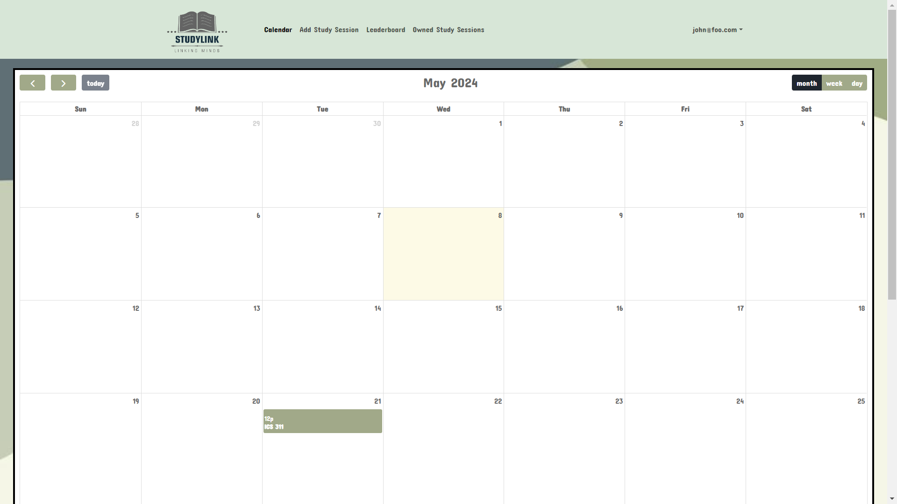

# StudyLink

## Overview 
Nowadays, it's pretty rare to see students interacting face-to-face with their peers. It's tough to ask for help when everyone else seems to be doing just fine. But have no fear, because StudyLink is here to help!

Our web platform connects students with others who are studying the same things. You can collaborate on assignments, projects, and exam prep with your buddies. With features like "create" and "attend," scheduling and joining study sessions has never been easier. Plus, you can keep track of past, present, and future study sessions, and see who else is involved.

StudyLink is simple and easy to use. It's a safe and supportive place where you can work together with your classmates and make studying more enjoyable.

StudyLink is an application that allows users to:
  * Register an account
  * Join /create a group
  * Set up your profile
  * Add your classes
  * Create Study Sessions
  * Leaderboard
  * View Calendar Study Sessions

## Developer Guide 

## Installation
The instructions below will guide you through the process of downloading, installing, running, and modifying the application on your local device.

1. In order to begin using the application you will need to install<a href="https://www.meteor.com/install"> Meteor.</a>

2. Next, you will need to clone our repository<a href="https://github.com/phoenix-codecrafters/StudyLink"> StudyLink </a>.

3. Using any IDE of your choice (our team used IntelliJ IDEA), in the command prompt you will need to cd into the app directory (within the code-directory file) and install the Meteor library as follows:
```
meteor npm install
```
 
4. Once the libraries are installed, you can run the application by invoking:
```
meteor npm run start
```

5. The first time you run the app, it will create some default users and data. Here is the output:

```
 meteor npm run start 

> meteor-application-template-react@ start /Users/carletonmoore/GitHub/ICS314/meteor-application-template-react/app
> meteor --no-release-check --exclude-archs web.browser.legacy,web.cordova --settings ../config/settings.development.json

[[[[[ ~/GitHub/StudyLink/app ]]]]]

=> Started proxy.                             
=> Started HMR server.                        
=> Started MongoDB.                           
I20220529-12:09:18.384(-10)? Creating the default user(s)
I20220529-12:09:18.389(-10)?   Creating user admin@foo.com.
I20220529-12:09:18.453(-10)?   Creating user john@foo.com.
=> Started your app.

=> App running at: http://localhost:3000/
```

If all goes well, the template application will appear at [http://localhost:3000](http://localhost:3000).

 You can login using the credentials in settings.development.json, or else register a new account.

6. Install fullcalendar to access calendar features:

 ```
meteor npm install --save @fullcalendar/core @fullcalendar/daygrid
```

7. Lastly, you can run ESLint over the code in the imports/ directory with:

```
meteor npm run lint
```

## User-Interface Guide

### Landing Page
The landing page serves as the entry point for users, where they can log in, register, learn about the developers, and read about the rules and regulations that they must adhere to when using the site. 

   

### About Us Page
The About us page offers users the opportunity to learn more about the developers behind this site. They also have the option to view each of the developers Github page and professional portfolios. 


### Rules and Regulations Page
The Rules and Regulations page offers a list of rules and regulations that the users must adhere to while using StudyLink. 


### Login Page
The login page enables users, both regular users and administrators, to access their accounts securely. Users are prompted to enter their credentials, ensuring authentication before accessing the system.

    

### Register
For new users, who don’t have an account yet, the register page offers a straightforward process to sign up. By providing necessary details, users can create their accounts and gain access to the system. 

    

### User home page
Upon successful login, users are directed to their personalized home page. Here, they can manage their account settings, access study material, view their calendar, and engage with other features tailor to their needs. 


### Admin home page
Administrators are greeted with a dedicated homepage upon login. This page grants access to administrative tools, allogin them to manage users, content, and system configurations effectively. 

   


### User profile page
The user profile page provides users with a centralized hub to view and manage their personal information. It offers options to edit profile details, manage their profile pictures, and customize their experience. 


### Calendar page
The calendar page offers users a visual representation of their study schedule or upcoming events Users Can view, add, or edit events, helping them stay organized and on track with their goals. 

   


### Study Sesh page
Within the study session page, users can access detailed information about scheduled study session.They can view session details, join ongoing sessions, or manage their own study groups effortlessly. 


## Game mechanic page(s) (for example, a leaderboard?)
The game mechanics page, such as the leaderboard, adds an element of gamification to the platform. It showcases user achievements, ranking, or progress, fostering engagement and healthy competition among users. 


### Owned Study Sessions
In this page users can view and edit study sessions which they own. 


## Deployment
* [Application Deployment Link](http://209.38.148.35/)

## Project Board Pages
* [M1 Project Board](https://github.com/orgs/phoenix-codecrafters/projects/1)
* [M2 Project Board](https://github.com/orgs/phoenix-codecrafters/projects/2)
* [M3 Project Board](https://github.com/orgs/phoenix-codecrafters/projects/4/views/1)

## External Links
* [Team Contract](https://docs.google.com/document/d/19e88MkfUT4tdWFnGkv8DtAIhVrYXPxZpmWGlqF-Ryiw/edit?usp=sharing)


## Meet the Developers

* [Benjamin Banilower](https://banilowben.github.io/)
* [Andrew Gibbons](https://andrewgibbons575.github.io)
* [Stephanie Castelblanco](https://stephanie-castelblanco.github.io/)
* [Michelle Back](https://michelle4929.github.io/)
* [Kelly Tam](https://ktam808.github.io/)

